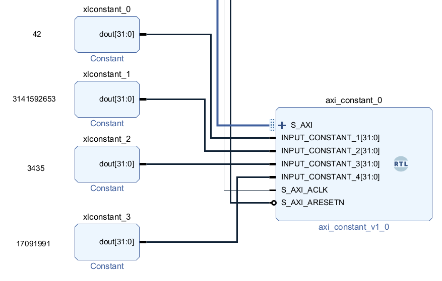
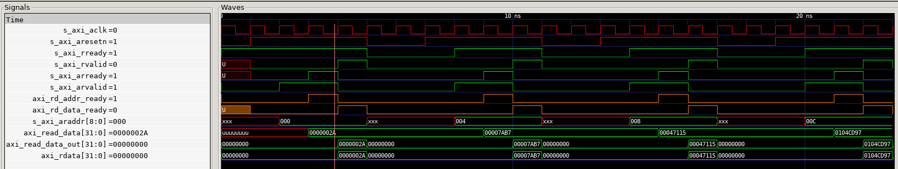

# AXI Constant Peripheral

## Description

The AXI Constant Peripheral is an AXI-compliant module designed to provide constant values based on the address input. It operates as a slave device on the Advanced eXtensible Interface (AXI) bus and offers four selectable constant outputs. These inputs can be extended further if needed.



## Simulation

Cocotb is used to verify the functionality and to perform the AXI read transactions.

## Issues

`aw_wrap_en` fails to simulate using GHDL. Fails in a bound check, so these are disabled for the
simulation as they are not needed. _ar_wrap_en is needed for the real synthesis if burst is used._
```vhdl
-- fails to simulate with ghdl
aw_wrap_en <= '1' when (((axi_awaddr AND std_logic_vector(to_unsigned(aw_wrap_size,C_S_AXI_ADDR_WIDTH))) XOR std_logic_vector(to_unsigned(aw_wrap_size,C_S_AXI_ADDR_WIDTH))) = low) else '0';
ar_wrap_en <= '1' when (((axi_araddr AND std_logic_vector(to_unsigned(ar_wrap_size,C_S_AXI_ADDR_WIDTH))) XOR std_logic_vector(to_unsigned(ar_wrap_size,C_S_AXI_ADDR_WIDTH))) = low) else '0';
```

## Setup for simulation

1. Clone the project
    `git clone https://github.com/Velho/axi-constant`
2. Install latest python 3.10+
3. Install the cocotb and dependencies

    `pip3 install cocotb cocotbext-axi`

4. Run the simulation

    `cd axi_constant`
    `make`

5. _Optional_ Waveform is produced under waveform.ghw

    
